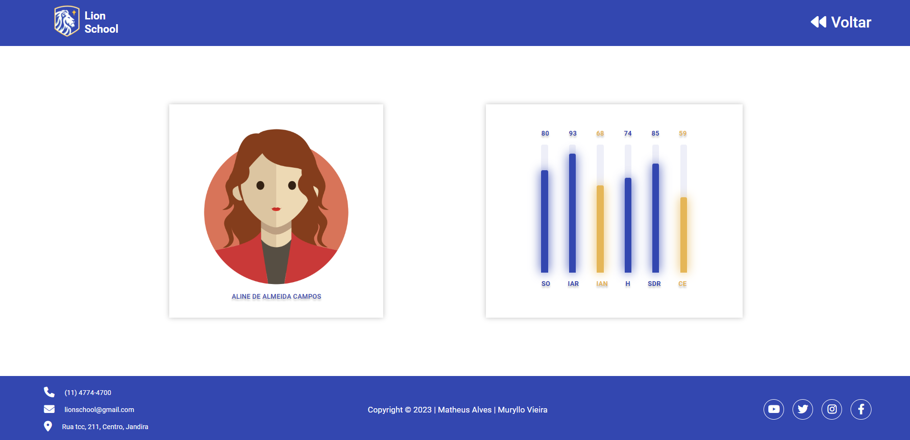

# Atividade integrada - Lion School 2023

[Link - Figma](https://www.figma.com/file/INOJT5FNYh2Bw7Jjvt1bWR/PWFE---Trabalho-Integrado---Lion-School?t=0ofjiAFBZwFR84Ic-6)

[Link - Github Page](https://matheusalves099.github.io/atividade-integrada-lion-school-2023-front-end/html/index)

# Objetivo

A atividade tem como objetivo integrar as disciplinas de PWFE (Programação web Front-end) e PWBE (Programação web Back-end) do curso de desenvolvimento de sistemas do SENAI Jandira.

O projeto é o gerenciamento da escola Lion School, deverá ser realizado tanto o back-end como o front-end.

# Critérios de Avaliação

- [X] Criou layout conforme designer feito no Figma?
- [X] Os botões dos cursos são dinâmicos?
- [X] Os cards são criados dinamicamente?
- [X] A página com informações dos cursos foi criada dinamicamente?
- [X] O filtro por status está funcional?
- [X] Os nomes das variáveis, funções e arquivos tem valor semântico?
- [X] A maioria das funções seguem as boas práticas como responsabilidade única?
- [X] Foi criado o layout responsivo no Figma?
- [X] Foi implementado a responsividade conforme planejado no Figma?
- [X] Foi criado o filtro por ano?

# Desktop Imagens

# Tecnologia utilizada 

- HTML5
- CSS3
- JavaScript
- Responsividade
- Markdown  
- JSON

# Autor 

- [Matheus Alves Reis da Silva](https://github.com/MatheusAlves099)
